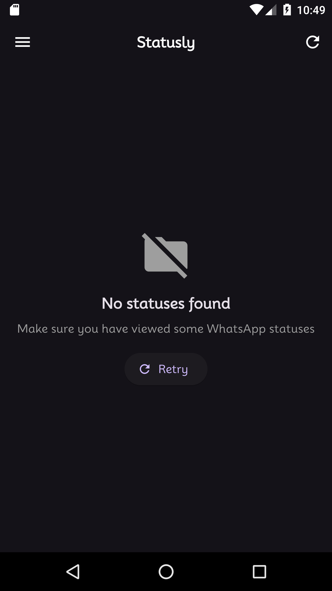
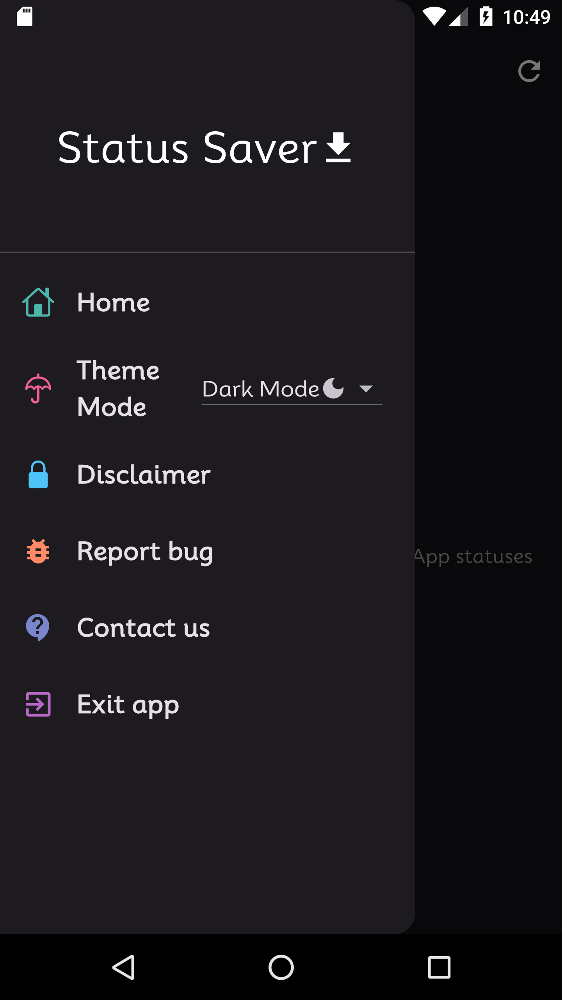
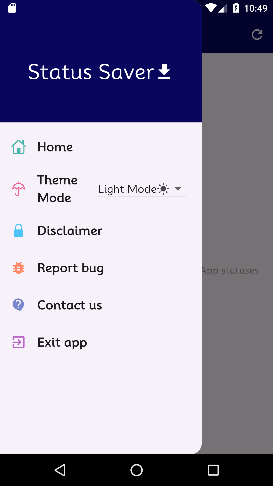
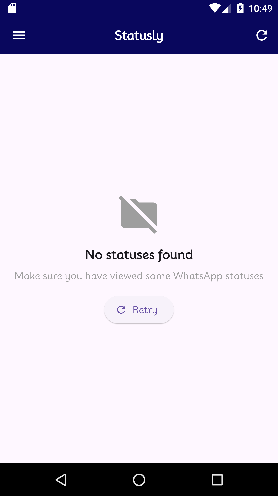

# WA Saver — WhatsApp Status Saver 📲

A **Flutter** app to view, save, and share **WhatsApp Status** (images & videos) directly from your device — with support for WhatsApp, WhatsApp Business, and popular mods (GB WhatsApp, FM WhatsApp, OG WhatsApp, YO WhatsApp, WhatsApp Plus, Aero, Delta, Fouad, and Prime WhatsApp).

---

## 📋 Table of Contents

- [Overview](#-overview)
- [Features](#-features)
- [Screenshots](#-screenshots)
- [Tech Stack](#-tech-stack)
- [Project Structure](#-project-structure)
- [Getting Started](#-getting-started)
- [Supported WhatsApp Variants](#-supported-whatsapp-variants)

---

## 🔎 Overview

WA Saver scans the local `.Statuses` media folders used by WhatsApp and its variants, lets you preview photos/videos in a full-screen viewer, and save or share them in one tap — no need to screenshot or screen-record statuses anymore.

## ✨ Features

- 📷 Browse recent WhatsApp image & video statuses
- 💾 Save statuses directly to your gallery
- 🔁 Share saved statuses to other apps
- 🌗 Light/Dark theme support
- 🌍 Multi-language UI — English, Hindi, Urdu, Spanish, Chinese
- 🔔 Local notifications
- ⏱️ Background auto-save via `workmanager`
- 🎞️ Built-in video thumbnail generation & playback (`chewie` / `video_player`)
- 🗂️ Works across WhatsApp, WhatsApp Business, and major WhatsApp mods

---

## 🖼 Screenshots

| Home | Status Viewer | Full Screen | Settings |
|---|---|---|---|
|  |  |  |  |

---

## 🧰 Tech Stack

- **Flutter / Dart** — cross-platform UI (Android, iOS, Windows, macOS, Linux, Web project scaffolding included)
- **GetX** (`get`) — state management, routing, and localization
- **video_player** + **chewie** — video preview/playback
- **share_plus** — sharing saved media
- **permission_handler** — storage/media permissions
- **workmanager** — background auto-save task
- **flutter_local_notifications** — local notifications
- **shared_preferences** — local settings persistence
- **device_info_plus** — device/Android version detection (for scoped storage handling)
- **media_scanner** — refreshing the Android media gallery after saving
- **flutter_svg** — vector icon rendering

---

## 🗂 Project Structure

```
WhatApp-Status-Saver-/
├── android/, ios/, linux/, macos/, windows/, web/   # Flutter platform projects
├── assets/                  # Fonts (Mooli) & SVG icons
├── lib/
│   ├── constants/            # App assets, colors, icons, drawer items
│   ├── controllers/          # Status handler & theme controllers (GetX)
│   ├── globals/               # config.dart — central export/barrel file
│   ├── helper/                 # UI helpers
│   ├── localization/            # en, hindi, spanish, ur, chinese
│   ├── services/                 # Notification services
│   ├── util/                      # status_saver.dart (core save logic), drawer, action buttons
│   └── views/                      # Appbar, status card, full-screen viewer, settings, thumbnails
├── flutter_01.png ... flutter_04.png   # App screenshots
└── pubspec.yaml
```

---

## 🚀 Getting Started

### Prerequisites
- Flutter SDK `^3.10.3`
- Android device/emulator with storage/media permissions (the app reads WhatsApp's `.Statuses` folder, which requires storage access permission on Android)

### Setup

```bash
# Install dependencies
flutter pub get

# Run on a connected device/emulator
flutter run
```

> **Note:** On Android 11+ this relies on scoped storage / `MANAGE_EXTERNAL_STORAGE`-style access to read WhatsApp's media folder — make sure storage permission is granted when prompted on first launch.

---

## 📱 Supported WhatsApp Variants

The app automatically checks the status folders of:

- WhatsApp
- WhatsApp Business
- GB WhatsApp / GB WhatsApp Pro
- FM WhatsApp
- OG WhatsApp
- YO WhatsApp
- WhatsApp Plus
- Aero WhatsApp
- Delta WhatsApp
- Fouad WhatsApp
- Prime WhatsApp

---

## ⚠️ Disclaimer

This app is an independent utility and is **not affiliated with, endorsed by, or connected to WhatsApp Inc. or Meta Platforms**. It only reads publicly accessible media files that WhatsApp itself stores on device storage.
